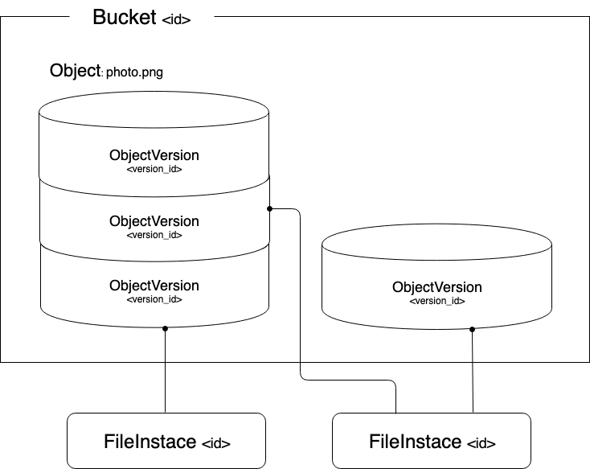

..
    This file is part of Invenio.
    Copyright (C) 2015-2019 CERN.

    Invenio is free software; you can redistribute it and/or modify it
    under the terms of the MIT License; see LICENSE file for more details.

Overview
========
Invenio-Files-REST is a files storage module. It allows you to store and
retrieve files in a similar way to Amazon S3 APIs.

Before getting started a brief overview will introduce you to the key concepts
and terminology of the module.

    Overview of Invenio-Files-REST

Location
--------
The first concept to introduce is :code:`Location`. Locations are used to
represent different storage systems. :code:`Location` has a :code:`name` and a
:code:`URI` which could be a path in a local directory or a URI on a remote
system. It is required to define at least one default location.

See the API section of :py:class:`invenio_files_rest.models.Location` for more
information.

Storage
-------
A backend :code:`Storage` provides the interface to interact with a
:code:`Location` and perform basic operations with files, such as retrieve,
store or delete.

By default, Invenio-Files-REST provides a simple local files storage
:py:class:`invenio_files_rest.storage.PyFSFileStorage`. You can define
your own storage with the configuration :py:data:`invenio_files_rest.config.FILES_REST_STORAGE_FACTORY`.

An example of a remote storage system can be found at
`Invenio-S3 <https://invenio-s3.readthedocs.io/>`_ which offers integration
with any S3 REST API compatible object storage.

See the API section of :py:class:`invenio_files_rest.storage` for more
information.

FileInstance
------------
Files on disk are represented with :code:`FileInstance`. A file instance
records the path to the file, but also its `Storage`, size and checksum of the
file on disk.

See the API section of :py:class:`invenio_files_rest.models.FileInstance` for
more information.

Object
------
An :code:`Object` is an abstract representation of the file metadata: it
doesn't come with its own data model but it is defined by
:code:`ObjectVersion`.

ObjectVersion
-------------
An :code:`ObjectVersion` represents a version of an :code:`Object` at a
specific point in time. It contains the :code:`FileInstance` that describes and
a set of metadata.

When it has no :code:`FileInstance`, it marks a deletion of a file as a delete
marker (or soft deletion).

The latest version of the file is referred to as the :code:`HEAD`.

Object version are very useful to perform operation on files metadata without
accessing directly to the storage. For example, multiple :code:`ObjectVersion`
can point to the same :code:`FileInstance`, allowing operations to be
performed more efficiently, such as snapshots without duplicating files or
migrating data.

See the API section of :py:class:`invenio_files_rest.models.ObjectVersion` for
more information.

ObjectVersionTag
----------------

:code:`ObjectVersionTag` is useful to store extra information for an
:code:`ObjectVersion`.

A :code:`ObjectVersionTag` is in the form of :code:`key: value` pair and an
:code:`ObjectVersion` can have multiple :code:`ObjectVersionTag`.

See the API section of
:py:class:`invenio_files_rest.models.ObjectVersionTag` for more information.

Bucket
------
Consider the :code:`Bucket` as a container for :code:`ObjectVersion` objects.
Just as in a computer, files are contained inside folders, each
:code:`ObjectVersion` has to be contained in a :code:`Bucket`.

The :code:`Bucket` is identified by an unique ID and is created in a
given :code:`Location` with a given :code:`Storage`.

:code:`ObjectVersion` are uniquely identified within a bucket by string keys.

.. .note::

    :code:`Objects` inside a :code:`Bucket` do not necessarily have the same
    :code:`Location` or :code:`Storage` class as the :code:`Bucket`.

A bucket can also be marked as deleted, in which case the contents become
inaccessible. It can also be permanently removed: in this case, all contained :code:`ObjectVersions` will be also deleted.

See the API section of :py:class:`invenio_files_rest.models.Bucket` for more
information.

BucketTag
---------
Similarly to :code:`ObjectVersionTag`, a :code:`BucketTag` is useful to store
extra information for a :code:`Bucket`.

A :code:`BucketTag` is in the form of :code:`key: value` pair and a
:code:`Bucket` can have multiple :code:`BucketTag`.

See the API section of :py:class:`invenio_files_rest.models.BucketTag` for
more information.
